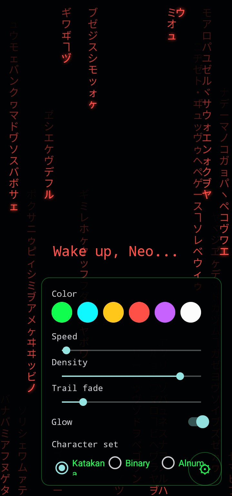
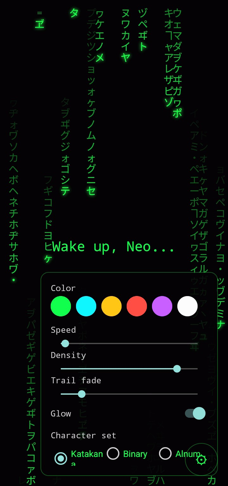
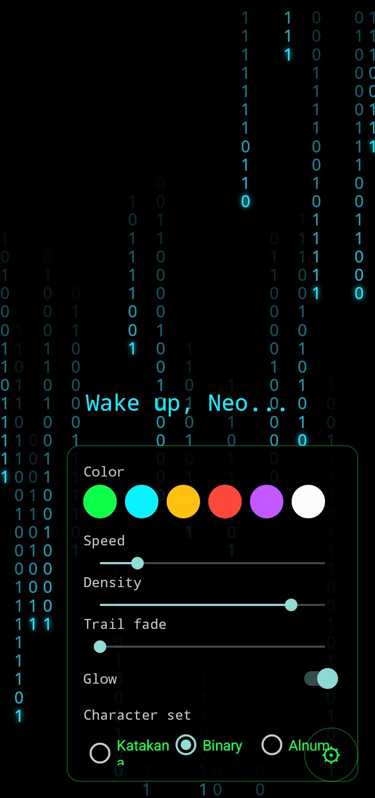

# matrix-rain-demo

A tiny sample app showing [matrix-rain-view](https://github.com/boy-offi9-inc/matrix-rain-view)
in the "background effect" use case: a `MatrixRainView` running full-screen
*behind* real UI, rather than as a full-screen effect on its own. Includes a
live settings panel demonstrating every runtime-configurable property the
library exposes.

## Screenshots

<p float="left">
  
  
  
</p>

[Screen recording (mp4)](assets/video.mp4) — GitHub doesn't play local repo
videos inline, so this is a direct download link rather than an embedded
player.

## What it shows

`activity_main.xml` wraps a `FrameLayout` around two children:

1. `MatrixRainView`, bottom-most, filling the screen
2. A centered `LinearLayout` with real content on top

That ordering matters — `LinearLayout` arranges children edge-to-edge and
can't stack them, so the rain view has to be a `FrameLayout` (or
`ConstraintLayout`) child, not a `LinearLayout` sibling. This app is a
working, running proof of that pattern instead of just a doc claim.

A settings panel (bottom-right gear icon) wires every runtime-configurable
property on `MatrixRainView` to a live control:

- Color — 6 swatches, also recolors the banner text to match
- Speed — 0.1x to 3.0x
- Density — 0.1x to 2.0x
- Trail fade
- Glow toggle
- Character set — Katakana / Binary / Alnum

Everything updates the running animation immediately — no restart needed —
since it's the same public properties any consuming app would use.

## Running it

Open in Android Studio and run the `app` module. A prebuilt debug APK is
available from the Actions tab (CI builds run on pushes to the `main`
branch).

The library itself is pulled from JitPack (latest release):

```kotlin
implementation("com.github.boy-offi9-inc:matrix-rain-view:1.0.1")
```

## License

MIT — see [LICENSE](./LICENSE).
